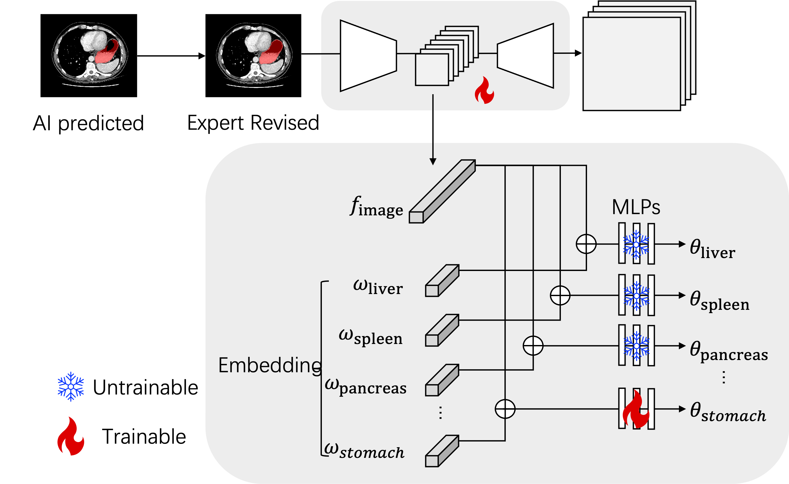
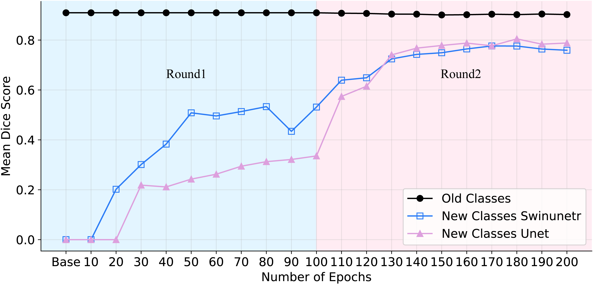

# Leveraging AI Predicted and Expert Revised Annotations in Interactive Segmentation: Continual Tuning or Full Training?

### Our proposed architecture.

<p align="center"></p>

## Paper

<b>Leveraging AI Predicted and Expert Revised Annotations in Interactive Segmentation: Continual Tuning or Full Training?</b> <br/>
[Tiezheng Zhang](https://github.com/ollie-ztz)<sup>1</sup>, [Xiaoxi Chen](https://github.com/skbtskbt)<sup>2</sup>, [Chongyu Qu](https://github.com/Chongyu1117)<sup>1</sup>, [Alan L. Yuille](https://www.cs.jhu.edu/~ayuille/)<sup>1</sup>, and [Zongwei Zhou](https://www.zongweiz.com/)<sup>1,*</sup> <br/>
<sup>1 </sup>Johns Hopkins University,  <br/>
<sup>2 </sup>Shanghai Jiao Tong University  <br/>
ISBI 2024 <br/>
[paper](https://arxiv.org/pdf/2402.19423.pdf) | [code](https://github.com/ollie-ztz/Continue_Tuning) | [poster](Coming Soon)

<b>RSNA 2023 (Oral Presentation)</b><br/>
[paper](documents/RSNA2023.pdf) | [code](https://github.com/ollie-ztz/Continue_Tuning) | [slides](documents/RSNA_Poster.pdf)


## 0. Installation

```bash
git clone https://github.com/ollie-ztz/Continue_Tuning
```
See [installation instructions](documents/INSTALL.md) to create an environment and obtain requirements.

## 1. Download AI models

We offer pre-trained checkpoints of Swin UNETR and U-Net. The models were trained on a combination of 14 publicly available CT datasets, consisting of 3,410 (see details in [CLIP-Driven Universal Model](https://github.com/ljwztc/CLIP-Driven-Universal-Model)).
Download the trained models and save them into `./pretrained_checkpoints/`.

| Architecture | Param | Download |
|  ----  | ----  |  ----  |
| U-Net  | 19.08M | [link](https://www.dropbox.com/s/lyunaue0wwhmv5w/unet.pth) |
| Swin UNETR | 62.19M | [link](https://www.dropbox.com/s/jdsodw2vemsy8sz/swinunetr.pth) |

## 2. Prepare your datasets

Our method could be applied to publicly available datasets (e.g.m BTCV) or your private datasets. For the public datasets, please refer to [Datasets](documents/Dataset.md). Currently, we only take data formatted in `nii.gz`. For example, using the BTCV dataset as a reference, organize your datasets following the structure outlined below. Create your own dataset list and store it in /dataset/dataset_list. The revised data should be arranged in the same format.
```bash
01_Multi-Atlas_Labeling/img/img0001.nii.gz	01_Multi-Atlas_Labeling/label/label0001.nii.gz
```


## 3. Train AI models

### 3.1 Round 1

##### U-Net
```bash
CUDA_VISIBLE_DEVICES=0,1,2,3,4,5,6,7 python -W ignore -m torch.distributed.launch --nproc_per_node=8 --master_port=$RANDOM train.py --dist True --backbone unet --data_root_path DATA_PATH --dataset_list DATA_LIST --batch_size 1 >>logs/DATASET.txt
```

##### Swin UNETR
```bash
CUDA_VISIBLE_DEVICES=0,1,2,3,4,5,6,7 python -W ignore -m torch.distributed.launch --nproc_per_node=8 --master_port=$RANDOM train.py --dist True --backbone swinunetr --data_root_path DATA_PATH --dataset_list DATA_LIST --batch_size 1 >>logs/DATASET.txt
```
### 3.2 Constructing Expert Resived data from AI predicted ones after Round 1. 
In our experiments, we select the data needed to be revised based on the [attention map](https://github.com/MrGiovanni/AbdomenAtlas?tab=readme-ov-file). In your settings, you could ask your annotators to revise all the data predicted by your models from Round 1.

We suggest that using our proposed Continual Tuning method to perform round 2. Then, in your dataset_list, you only need the revised data. While, if you want to train from scratch, please use the same amount of data as previous step.

### 3.3.1 Round 2 (Continual Tuning)

##### U-Net
```bash
CUDA_VISIBLE_DEVICES=0,1,2,3,4,5,6,7 python -W ignore -m torch.distributed.launch --nproc_per_node=8 --master_port=$RANDOM train.py --dist True --backbone unet --data_root_path DATA_PATH --dataset_list DATA_LIST --continual_tuning >>logs/DATASET.txt
```

##### Swin UNETR
```bash
CUDA_VISIBLE_DEVICES=0,1,2,3,4,5,6,7 python -W ignore -m torch.distributed.launch --nproc_per_node=8 --master_port=$RANDOM train.py --dist True --backbone swinunetr --data_root_path DATA_PATH --dataset_list DATA_LIST --continual_tuning >>logs/DATASET.txt
```
The expected reults after two rounds are shown below.
<p align="center"></p>

### 3.3.2 Round 2 (Full Tuning)

```bash
CUDA_VISIBLE_DEVICES=0,1,2,3,4,5,6,7 python -W ignore -m torch.distributed.launch --nproc_per_node=8 --master_port=$RANDOM train.py --dist True --backbone unet --data_root_path DATA_PATH --dataset_list DATA_LIST --batch_size 1 >>logs/DATASET.txt
```

##### Swin UNETR
```bash
CUDA_VISIBLE_DEVICES=0,1,2,3,4,5,6,7 python -W ignore -m torch.distributed.launch --nproc_per_node=8 --master_port=$RANDOM train.py --dist True --backbone swinunetr --data_root_path DATA_PATH --dataset_list DATA_LIST --batch_size 1 >>logs/DATASET.txt
```

## 4. Test AI models

##### U-Net
```bash
CUDA_VISIBLE_DEVICES=0 python -W ignore test.py --resume CHECKPOINT_PATH --backbone unet --save_dir SAVING_PATH --dataset_list DATA_LIST --data_root_path DATA_PATH --store_result >> logs/DATASET.unet.txt
```

##### Swin UNETR
```bash
CUDA_VISIBLE_DEVICES=0 python -W ignore test.py --resume CHECKPOINT_PATH --backbone swinunetr --save_dir SAVING_PATH --dataset_list DATA_LIST --data_root_path DATA_PATH --store_result >> logs/DATASET.unet.txt
```


## Citation 

```
@article{zhang2024leveraging,
  title={Leveraging AI Predicted and Expert Revised Annotations in Interactive Segmentation: Continual Tuning or Full Training?},
  author={Zhang, Tiezheng and Chen, Xiaoxi and Qu, Chongyu and Yuille, Alan and Zhou, Zongwei},
  journal={arXiv preprint arXiv:2402.19423},
  year={2024}
}
```

## Acknowledgements
This work was supported by the Lustgarten Foundation for Pancreatic Cancer Research and partially by the Patrick J. McGovern Foundation Award. We appreciate the effort of the MONAI Team to provide open-source code for the community.
